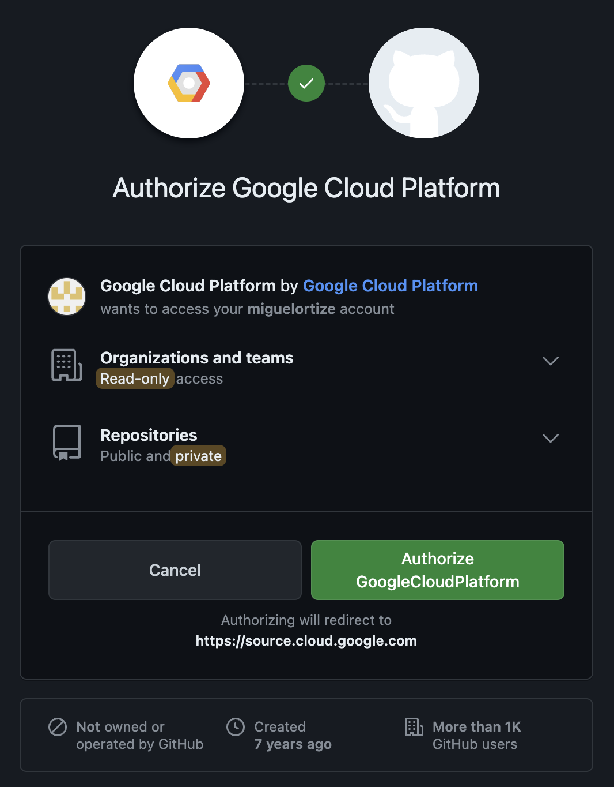
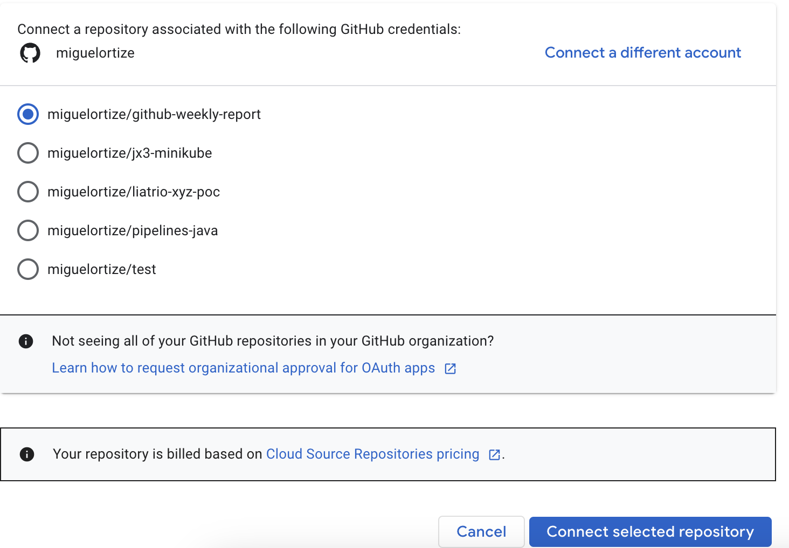
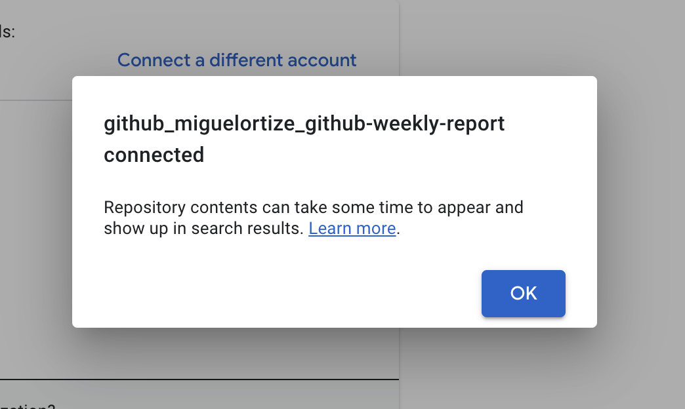

# github-weekly-report
Project created with the purpose to create Github Reports.

We created the secret manually in order to avoid interpolation of code/vs human intervention and to avoid security issues while allowing to run terraform locally as long as the GCP credentials exist.

docker pull mcr.microsoft.com/mcr/hello-world
docker tag mcr.microsoft.com/mcr/hello-world miguelcontainertest.azurecr.io/azurefunctionsimage:v1.0.0

docker push miguelcontainertest.azurecr.io/azurefunctionsimage:v1.0.0








Test:
https://us-central1-test-project-miguel.cloudfunctions.net/pull-request-summary?user=kubernetes&repo=kubernetes

Permission management:
```
PROJECT_NAME=test-project-miguel
PROJECT_ID=105688756382
GCP_SERVICE_ACCOUNT=wip-service-account
gcloud iam service-accounts add-iam-policy-binding "${GCP_SERVICE_ACCOUNT}@${PROJECT_NAME}.iam.gserviceaccount.com" \
  --project="${PROJECT_NAME}" \
  --role="roles/iam.workloadIdentityUser" \
  --member="principalSet://iam.googleapis.com/projects/${PROJECT_ID}/locations/global/workloadIdentityPools/liatrio-xyz-poc/attribute.repository/miguelortize/github-weekly-report"
```