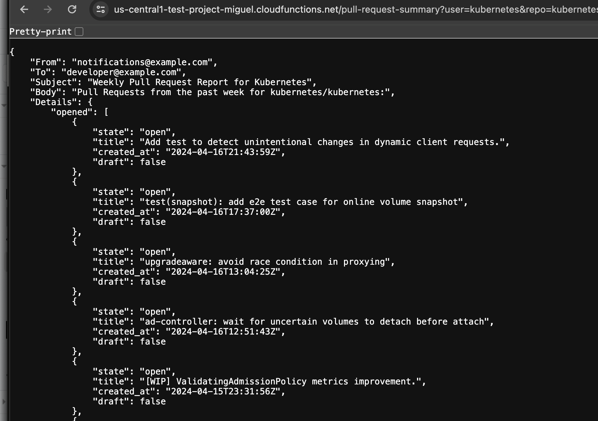
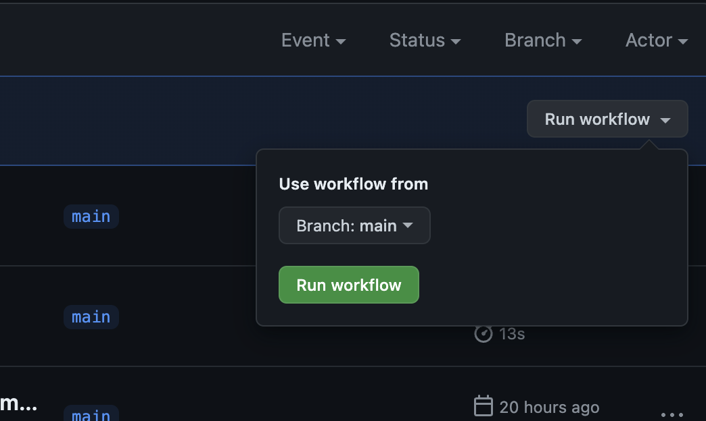
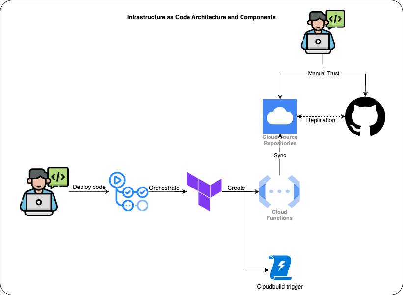
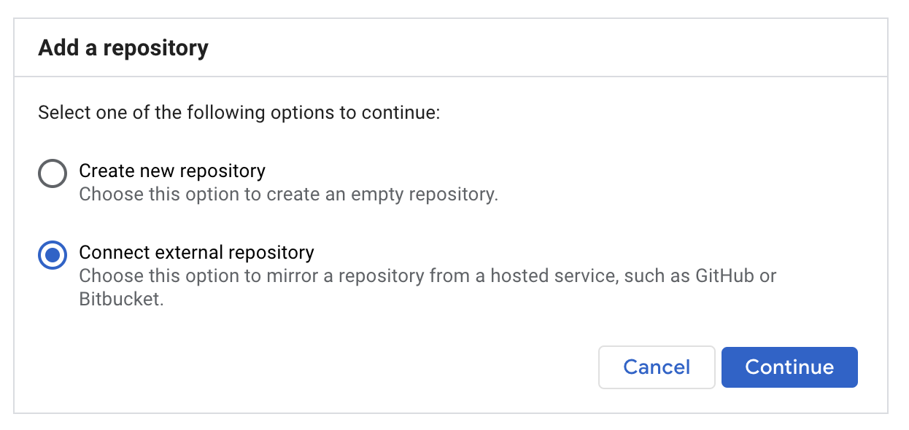
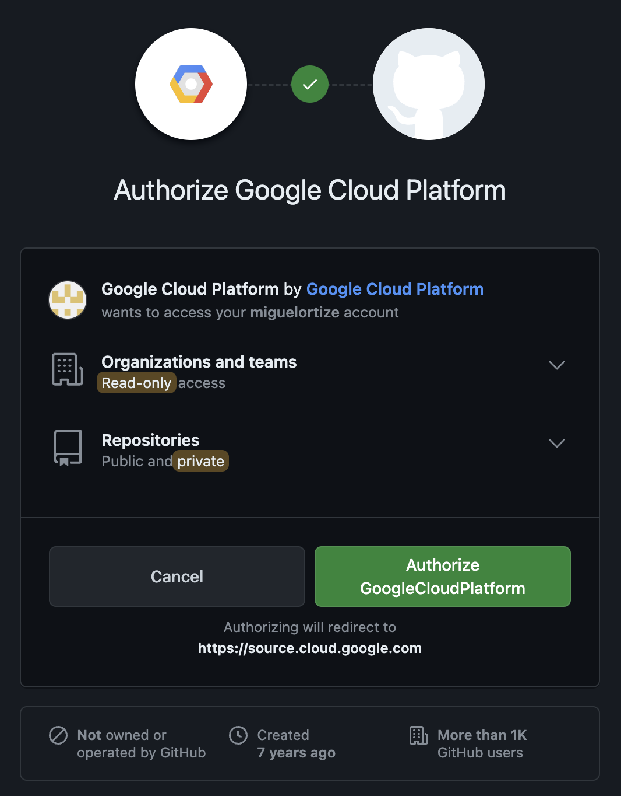
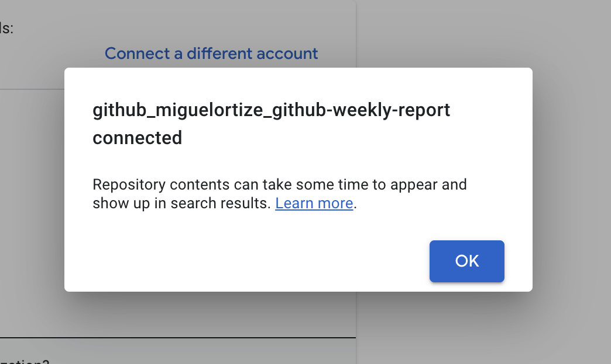

# Github Weekly Report PoC

Project created with the purpose to generate Github Email Reports through Github Actions Cronjobs and GCP cloud functions.

# User Documentation (TL;DR)

Direct Manual Test (ideally, this will only be through authentication, but for PoC purposes, it is open to public):

Open your browser and go to https://us-central1-test-project-miguel.cloudfunctions.net/pull-request-summary?user=kubernetes&repo=kubernetes



This project is fully automated through [Github Actions Cronjobs](https://github.com/miguelortize/github-weekly-report/blob/main/.github/workflows/function_scheduler.yml) and does not require human intervention to run weekly reports, however, if it is necessary, users can test directly through [workflow_dispatch](https://github.com/miguelortize/github-weekly-report/actions/workflows/function_scheduler.yml), or going directly to `Actions` > `Weekly Pull Request Summary` > `Run Workflow`, choose main and execute the workflow.



This workflow will deploy and use a `GITHUB_USER` and a `GITHUB_REPO`, if you wish to change these values, you can do it direclty by creating a PR and modifying the values at the [Github Actions Function Scheduler](https://github.com/miguelortize/github-weekly-report/blob/main/.github/workflows/function_scheduler.yml) `.github/workflows/function_scheduler`.

The same way, if you want to add more weekly tests, you can append a new step and add your own GITHUB_USER and GITHUB_REPO:

```yaml
# Example:
    - name: Generate octocat/Hello-World pull request summary
      env:
        GITHUB_USER: octocat
        GITHUB_REPO: Hello-World
      run: |
        curl -X GET "https://us-central1-test-project-miguel.cloudfunctions.net/pull-request-summary?user=${{ env.GITHUB_USER }}&repo=${{ env.GITHUB_REPO }}"
```

To change the email_from and email_to values, this has to be done at `terraform/terraform.tfvars`

```hcl
# Example:
email_from = "foo@example.com"
email_to   = "bar@example.com"
```

> [!IMPORTANT]  
> Only Platform Administrators can change the email_from and email_to values.

# Resource Deploment Strategy



Users will deploy their infrastructure by creating and merging a PR to the `terraform` folder, the terraform Github Action workflow, will run terraform to create and maintain a state of the resources, this will include:

### Terraform

- Cloud Function: The cloud function has an http trigger that allows it to run the code defined at the `python_functions/github_weekly_report/` path, this is a function that connects to Github with Github Token authentication and searches for a give repository and user, gets the PR information of the last 7 days and returns it on an email format.
- Cloudbuild Trigger: This cloudbuild trigger is directly connected to the Cloud Source Repository which is in sync with this Github repository, so any changes here, are reflected in GCP and this allows us to execute this trigger whenever there are changes at `python_functions/github_weekly_report/` level.

### Manual Execution

- At the moment, there is no automation for the Github and Cloud Source Repository synchronization, this is a process that has to be done manually, go to [Cloud Source Repositories](https://source.cloud.google.com/test-project-miguel?authuser=0) and `Add Repository`, add a `External Repository` as shown below:



- Select Github Provider and setup synchronization GCP with Github Actions:



- Select this repository and continue, you should see something like this at the end:



# Permission management:

## Add your repository to the workload identity pool.

```bash
PROJECT_NAME=test-project-miguel
PROJECT_ID=105688756382
GCP_SERVICE_ACCOUNT=wip-service-account
gcloud iam service-accounts add-iam-policy-binding "${GCP_SERVICE_ACCOUNT}@${PROJECT_NAME}.iam.gserviceaccount.com" \
  --project="${PROJECT_NAME}" \
  --role="roles/iam.workloadIdentityUser" \
  --member="principalSet://iam.googleapis.com/projects/${PROJECT_ID}/locations/global/workloadIdentityPools/liatrio-xyz-poc/attribute.repository/miguelortize/github-weekly-report"
```

## Permissions on Cloudbuild for GCP resource management:


```bash
gcloud projects add-iam-policy-binding test-project-miguel \
    --member='serviceAccount:105688756382@cloudbuild.gserviceaccount.com' \
    --role='roles/cloudfunctions.developer'

gcloud projects add-iam-policy-binding test-project-miguel \
    --member='serviceAccount:105688756382@cloudbuild.gserviceaccount.com' \
    --role='roles/viewer'
```

## Provide access to cloudbuild to act as user for cloud function deployment

```bash
gcloud iam service-accounts add-iam-policy-binding test-project-miguel@appspot.gserviceaccount.com \
    --member='serviceAccount:105688756382@cloudbuild.gserviceaccount.com' \
    --role='roles/iam.serviceAccountUser'
```